# Node.js Practical - Screenshots

This document provides screenshots of the application to give a visual overview of its features and functionality.

## User Register

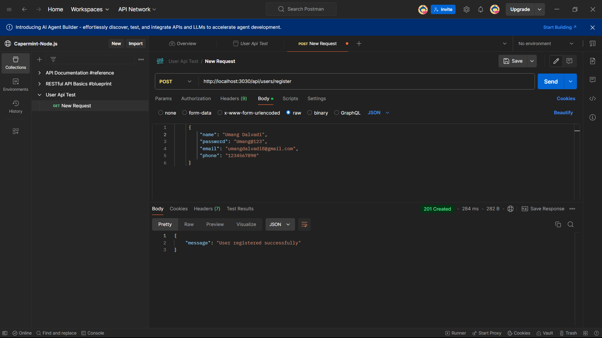

## User Login

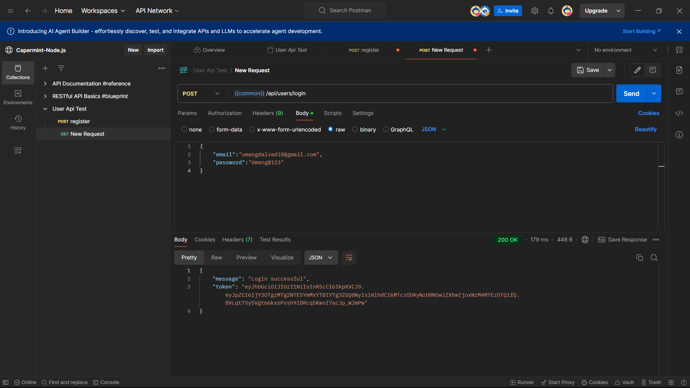

## Update User Profile

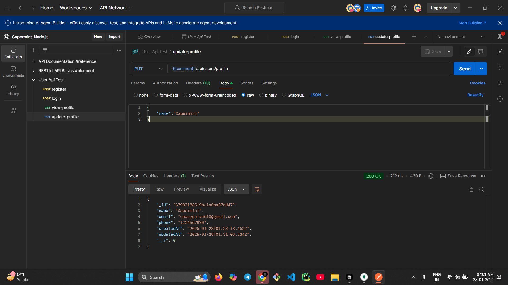

## View User Profile

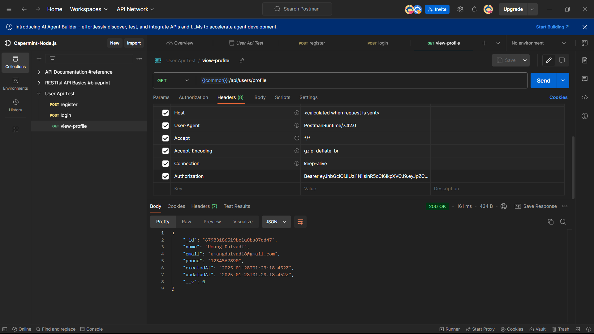

## Admin Login

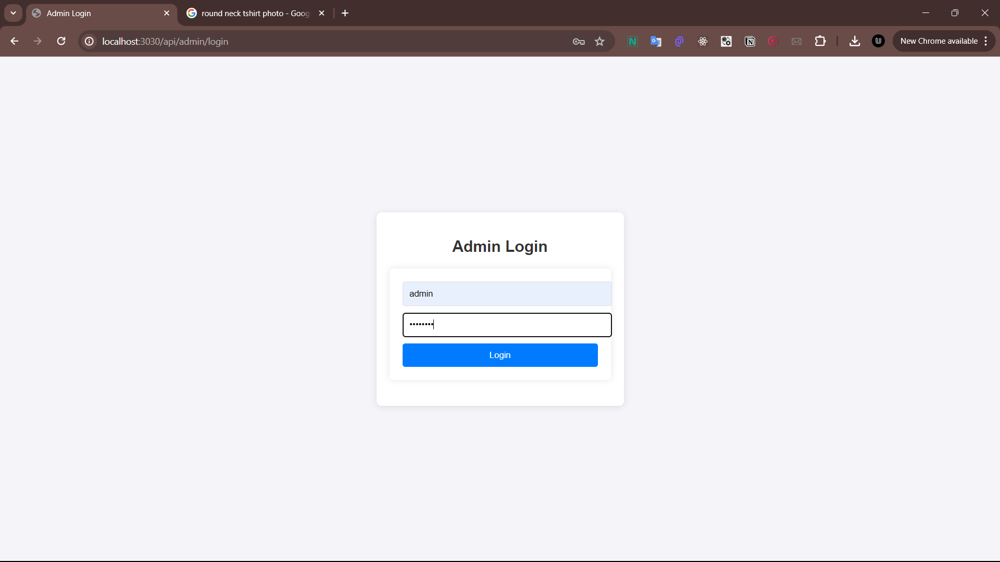

## Admin Dashboard

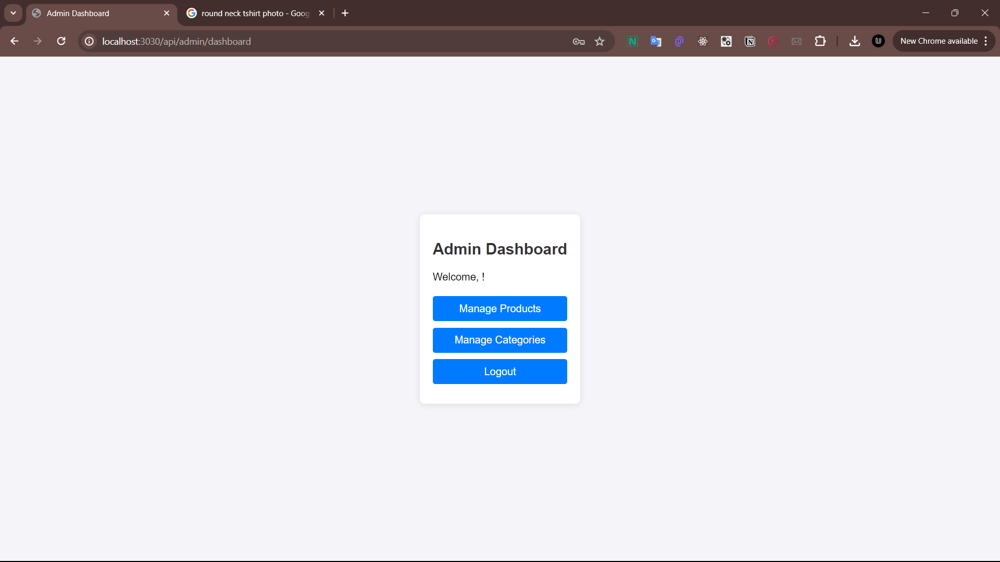

## Category Management

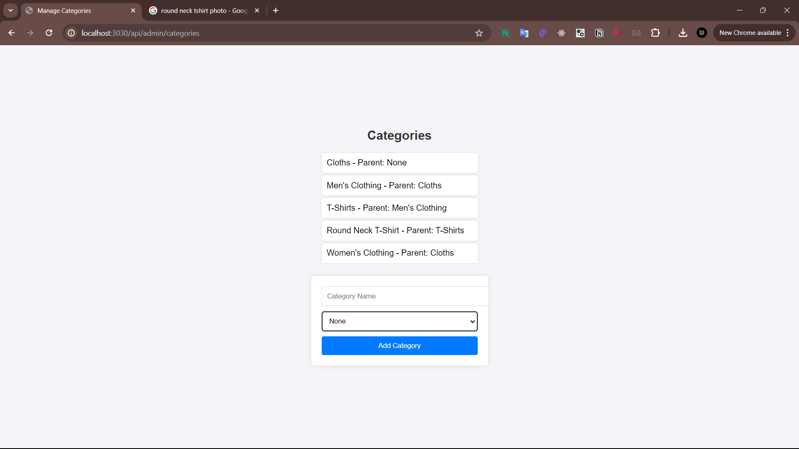

## Product Management

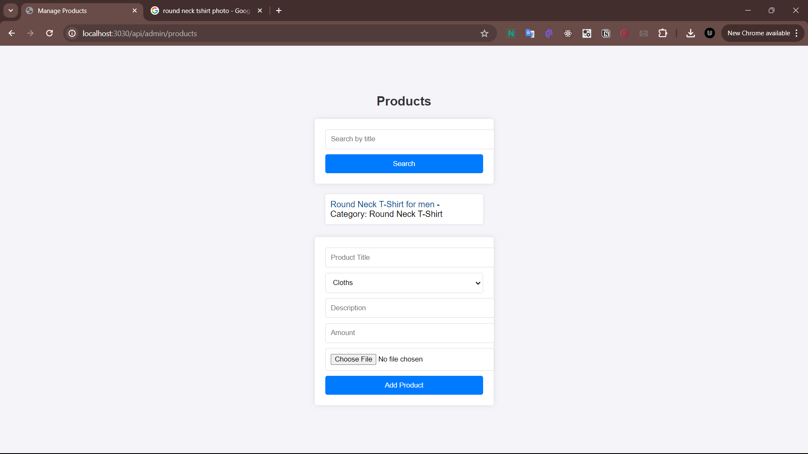

## Add Product

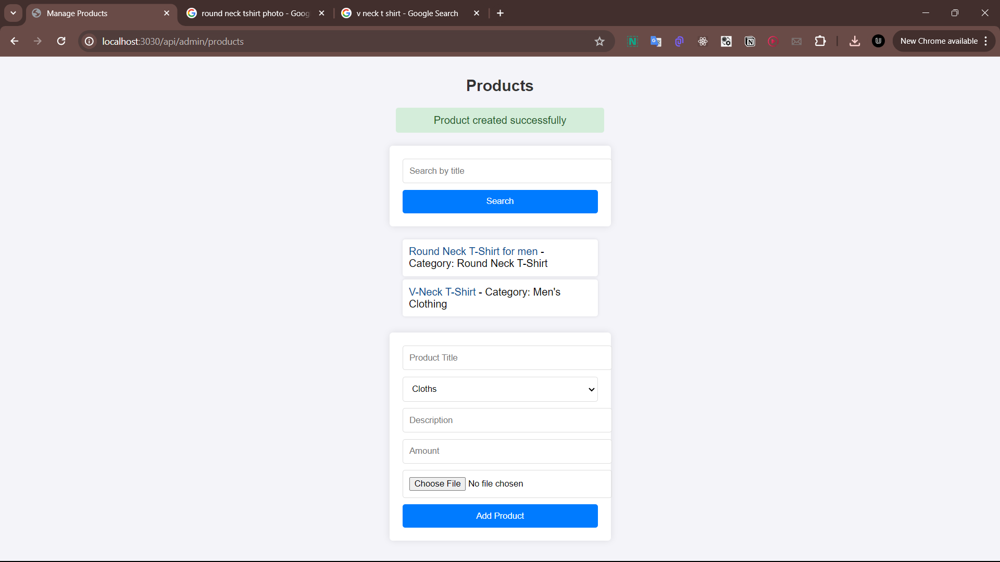

## Product Details

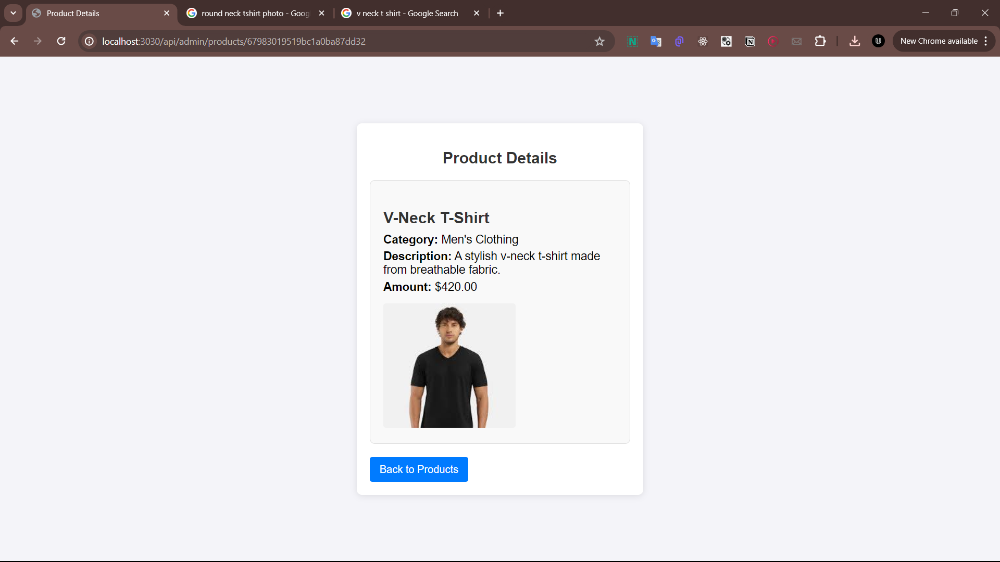

## Search Product

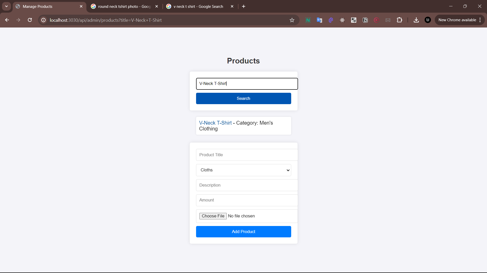
